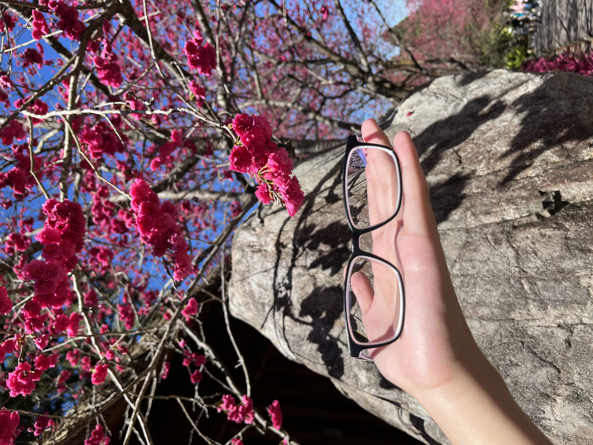
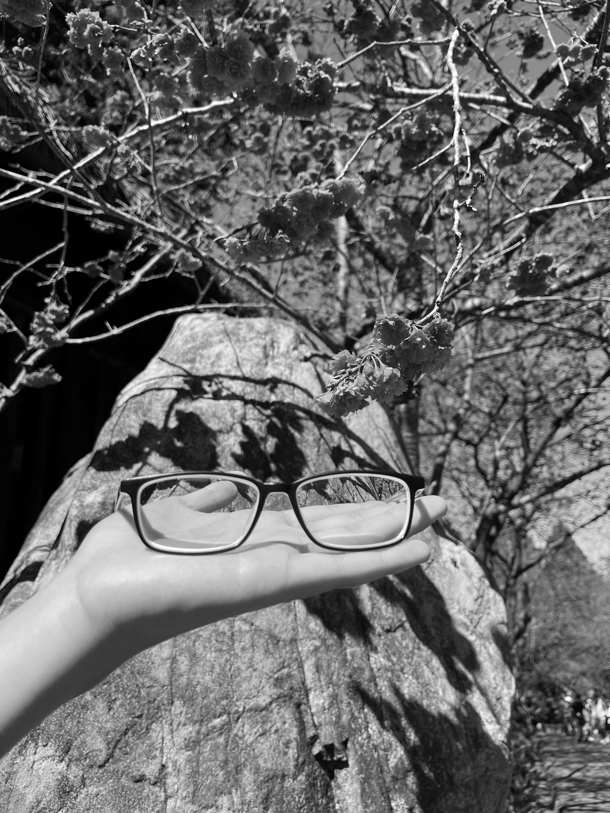
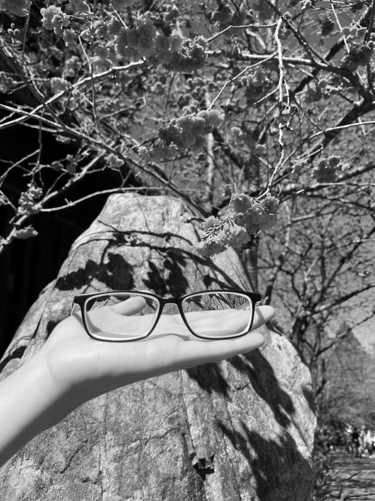

### 資工系大四 40747024S 于子緯（58 號）

## Problem statement

Homework 1

1. Input a color image $C(R,G,B)$
2. Output the color image $C$
3. Transform the color image $C$ into a grayscale image $I$ by $I = (R+G+B)/3$
4. Show the grayscale image $I$

## Experimental results


| Input color image                               | Output grayscale image                           |
| ----------------------------------------------- | ------------------------------------------------ |
|  |  |


## Source code

### 方法一：

直接使用函數 `cv2.cvtColor` 轉換顏色，由於 opencv 預設是 BGR，故第二個參數代 `cv2.COLOR_BGR2GRAY`。

```python
import cv2
image = cv2.imread("input.jpeg")
image = cv2.cvtColor(image, cv2.COLOR_BGR2GRAY)
cv2.imwrite('output.jpeg', image)
```

### 方法二：

將每個 pixel 的 R, G, B 都設為 $(R+G+B)\ /\ 3$ 的值。

```python
import cv2
image = cv2.imread("input.jpeg")
for row in range(image.shape[0]):
    for col in range(image.shape[1]):
        image[row][col] = [sum(image[row][col]) / 3] * 3
cv2.imwrite('output.jpeg', image)
```

以上程式可以使用矩陣乘法加速

```python
import cv2
import numpy as np
image = np.array(cv2.imread("input.jpeg"))
m = [[1/3] * 3] * 3
for row in range(image.shape[0]):
    image[row] = np.matmul(image[row], m)
cv2.imwrite('output.jpeg', image)
```

## Comments

1. 在搜尋圖片轉灰階相關做法時，知道計算 RGB 平均是比較簡單的做法，另有其他公式，如 $0.299 \times R + 0.587 \times G + 0.114 \times B$ ，是考慮到人眼對 RGB 的感受不同來計算。

| $(R+G+B)\ /\ 3$                                  | $0.299 \times R + 0.587 \times G + 0.114 \times B$ |
| ------------------------------------------------ | -------------------------------------------------- |
|  |    |

2. 一開始撰寫程式的時候，忘記將 $R+G+B$ 的結果除以 $3$，結果得到錯誤的照片，但也有意外的效果。


