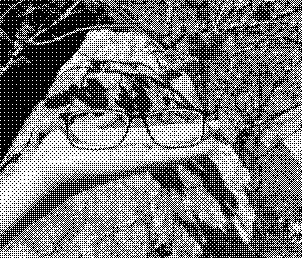

### 資工系大四 40747024S 于子緯（58 號）

## Problem statement

Homework 2

## Experimental results

| Input grayscale image         | Output image (A)                 | Output image (B)                 |
| ----------------------------- | -------------------------------- | -------------------------------- |
|  |  |  |

## Source codeComments

