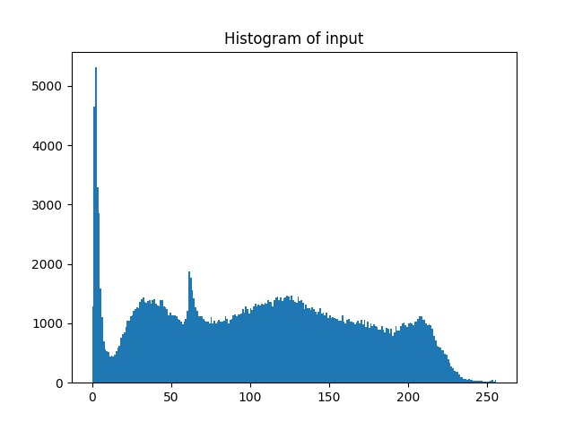
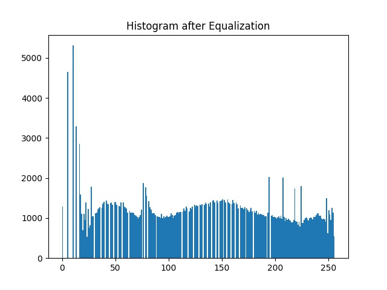

### 資工系大四 40747024S 于子緯（58 號）

## Problem statement

Homework 3

<div style="display: flex">

</div>

## Experimental results


| Input grayscale image & Histogram | Output image & Histogram  |
| ----------------------------- | ------------------------------ |
|  |  |
|  |  |


| Input color image & Histogram | Output image & Histogram  |
| ----------------------------- | ------------------------------ |
|  |  |
|  |  |

## Source code

```python
import cv2
from matplotlib import pyplot as plt

# Grayscale Image
img = cv2.imread("input-gray.jpeg", 0)

plt.title('Histogram of input')
plt.hist(img.ravel(), 256, [0, 256])
plt.savefig('./input-gray-hist.jpeg')
plt.clf()

img = cv2.equalizeHist(img)
cv2.imwrite('./output-gray.jpeg', img)

plt.clf()
plt.title('Histogram after Equalization')
plt.hist(img.ravel(), 256, [0, 256])
plt.savefig('./output-gray-hist.jpeg')
plt.clf()

# Color Image

img = cv2.imread("input-color.jpeg")

img_in_grayscale = img
cv2.cvtColor(img_in_grayscale, cv2.COLOR_BGR2GRAY)
plt.title('Histogram of input')
plt.hist(img_in_grayscale.ravel(), 256, [0, 256])
plt.savefig('./input-color-hist.jpeg')
plt.clf()

R, G, B = cv2.split(img)
R = cv2.equalizeHist(R)
G = cv2.equalizeHist(G)
B = cv2.equalizeHist(B)
equ_img = cv2.merge((R, G, B))
cv2.imwrite('./output-color.jpeg', equ_img)

plt.title('Histogram after Equalization')
plt.hist(equ_img.ravel(), 256, [0, 256])
plt.savefig('./output-color-hist.jpeg')
plt.clf()
```

## Comments

1. 在使用 `plt.hist()` 時，第一個參數可以使用  `ravel()` 或 `flatten()`，差別在於 `flatten` 會 copy 原本的 array，`ravel` 則是 reference，`flatten` 相較於 `ravel` 也比較慢一些。

2. 在 Color image 的處理，有找到另一個作法是將 R, G, B 各自分開做 equalization，再合併成 Color image。

