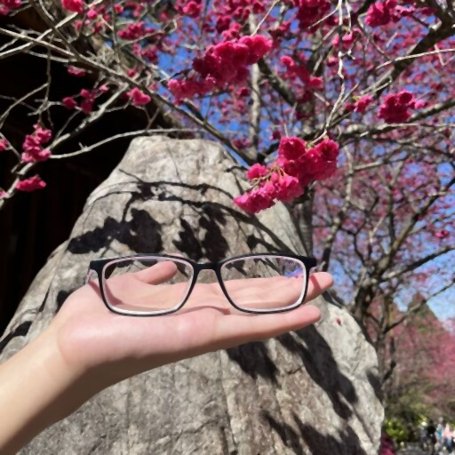
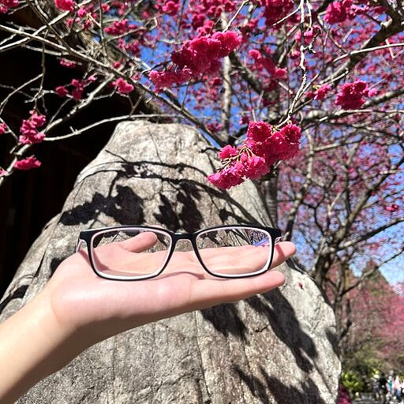
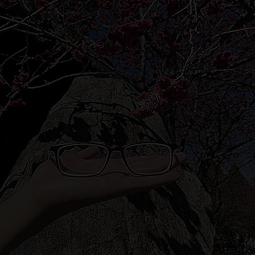

### 資工系大四 40747024S 于子緯（58 號）

## Problem statement

Homework 4

<div style="display: flex">

</div>
## Experimental results


| Input image |
| ----------------------------- |
|  |


| 3x3 Average filter | 3x3 Median filter | Unsharp masking |
| ----------------------------- | ------------------------------ | ------------------------------ |
|  |   |  |

## Source code

```python
import cv2

img = cv2.imread("input.jpeg")

avg_filtered_img = cv2.blur(img, (3, 3))
cv2.imwrite('./output-avg.jpeg', avg_filtered_img)

me_filtered_img = cv2.medianBlur(img, 3)
cv2.imwrite('./output-me.jpeg', me_filtered_img)

low_pass_filtered_img = cv2.GaussianBlur(img, (3, 3), 0)
filtered_scaled_img = low_pass_filtered_img * (k := 0.9)
usm_img = img + (img - filtered_scaled_img)
cv2.imwrite('./output-usm.jpeg', usm_img)
cv2.imwrite('./output-mask.jpeg', img - filtered_scaled_img)
```

## Comments

1. 整理獲得 unsharpened image 的方法為：$\text{image} + (\text{image} - \text{blurred} \times k)$，其中 $k$ 為 scaling factor。
2. 在過程中將加回原 image 的數值存起來得到以下圖片，可以看到愈平滑的地方愈黑，而石頭和手部不知道是不是因為紋路複雜，保留蠻多顏色的，導致最後加回原圖後這些部分變亮。


