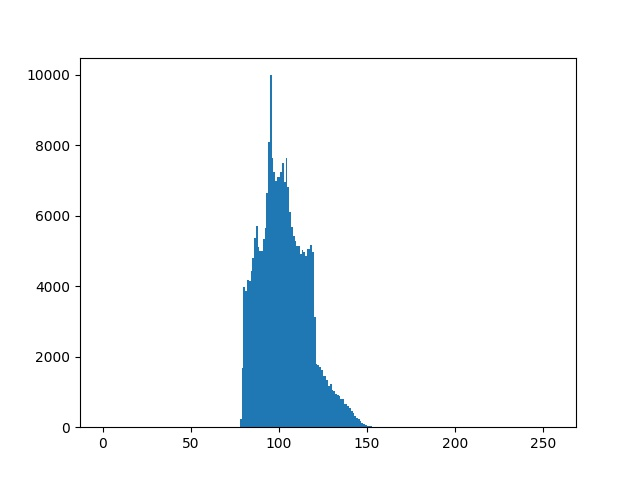

### 資工系大四 40747024S 于子緯（58 號）

## Problem statement

| Homework 5 |
| :---------------------------: |
|  |

## Experimental results


| Input image (gray image) | Histogram |
| :---------------------------: | :---: |
|  |  |

| Sigma | Noise image | Histogram |
| :---------------------------: | :---: | :---: |
| 5 |  |  |
| 10 |  |  |

## Source code

```python
import random
import cv2
import numpy as np
from cmath import cos, sin, sqrt, log
from matplotlib import pyplot as plt

def add_noise(noise_img, sigma):
    for x in range(noise_img.shape[0]):
        for y in range(noise_img.shape[1] - 1):
            # generate random number r, phi
            r, phi = random.uniform(0, 1), random.uniform(0, 1)
            z1 = sigma * cos(2 * np.pi * phi) * sqrt(-2 * log(r))
            z2 = sigma * sin(2 * np.pi * phi) * sqrt(-2 * log(r))
            noise_img[x][y] = max(0, min(255, noise_img[x][y] + z1))
            noise_img[x][y+1] = max(0, min(255, noise_img[x][y+1] + z2))

img = np.full((512, 512), 100, dtype=np.uint8)
cv2.imwrite('./gray.jpeg', img)
plt.hist(img.ravel(), 256, [0, 256])
plt.savefig('./gray-hist.jpeg')
plt.clf()

noise_img = img.copy()
add_noise(noise_img, sigma=10)
cv2.imwrite('./noise-10.jpeg', noise_img)
plt.hist(noise_img.ravel(), 256, [0, 256])
plt.savefig('./noise-10-hist.jpeg')
plt.clf()

noise_img = img.copy()
add_noise(noise_img, sigma=5)
cv2.imwrite('./noise-5.jpeg', noise_img)
plt.hist(noise_img.ravel(), 256, [0, 256])
plt.savefig('./noise-5-hist.jpeg')
```

## Comments

1. 給定的標準差愈大，pixel value 的範圍愈廣，noise 的效果變大。
2. 在 `z1`, `z2` 的計算要產生兩個亂數 `r`, `phi`，我故意讓 `r` 等於 `phi` 的值，發現產生出來的結果就不是常態分布了。

| Sigma | Noise image | Histogram |
| :---------------------------: | :---: | :---: |
| 5 |  |  |
| 10 |  |  |