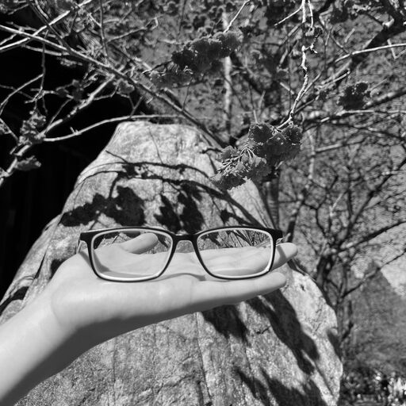
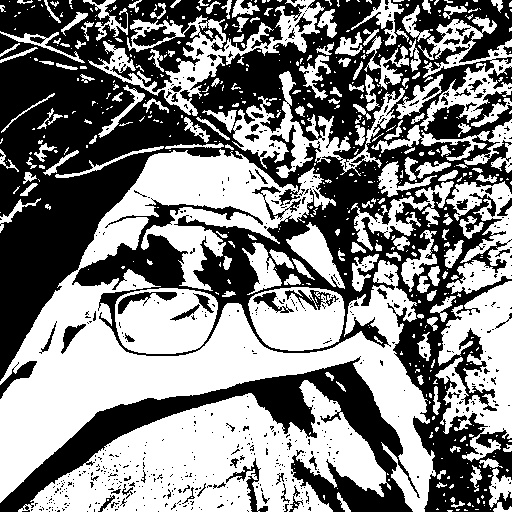

### 資工系大四 40747024S 于子緯（58 號）

## Problem statement

| Homework 6 |
| :---------------------------: |
|  |

## Experimental results


| Input image | Output image |
| :---------------------------: | :---: |
|  |  |

## Source code

```python
import cv2

def otsu(histogram):
    total = sum(histogram)
    probabilities = [hist / total for hist in histogram]
    m = sum(i * probabilities[i] for i in range(len(probabilities)))
    m_a = 0.0
    a = 0.0
    mx, threshold = 0.0, -1
    for i in range(256):
        m_a += i * probabilities[i]
        a += probabilities[i]
        if a == 0 or (1 - a) == 0:
            continue
        v = (m_a - m * a) ** 2 / (a * (1 - a))
        if v > mx:
            threshold = i
            mx = v
    return threshold


img = cv2.imread("input.jpeg", 0)
hist = cv2.calcHist([img], [0], None, [256], [0,256])
threshold = otsu(hist)
img[img >= threshold] = 255
img[img < threshold] = 0

cv2.imwrite('./output.jpeg', img)
```

## Comments

1. 在 `t = 0`, `t = 255` 時分母為零，沒辦法做除法所以就跳過。另外機率為零（沒有出現過）的值也可以跳過。
1. 在網路上看到一個版本，如果有兩個 `t` 皆是最大值，取他們的平均。
